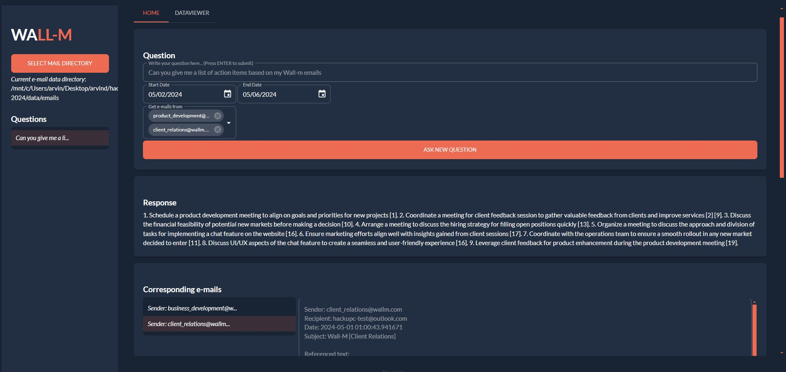

# WALL-M: A Platform for Retrieval Augmented Generation (RAG) for Question-Answering of E-Mails



This project was completed for the HackUPC 2024 Hackathon in Barcelona! We utilized the [Vector Search capability to the InterSystems IRIS Data Platform](https://www.intersystems.com/news/iris-vector-search-support-ai-applications/) to solve the problem of question-answering with semantic search whilst trying to prevent model hallucinations.

The repository contains the complete question-answering platform, which you can set up with the steps below. However, note that you currently need an OpenAI and an AI21 Labs key to utilize the models. In the future, we hope this platform can be extended to provide local LLMs instead of commercial solutions. Furthermore, we hope to integrate a direct connection to Outlook.  

## WALL-M Setup

1. Clone the repo
    ```Shell
    git clone git@github.com:lars-quaedvlieg/WALL-M.git
    ```
   
2. Change your directory to hackupc-2024
    ```Shell
    cd hackupc-2024
    ```

3. Install IRIS Community Edtion in a container, which will open a port on your device for the IRIS database system:
    ```Shell
    docker run -d --name iris-comm -p 1972:1972 -p 52773:52773 -e IRIS_PASSWORD=demo -e IRIS_USERNAME=demo intersystemsdc/iris-community:latest
    ```
    :information_source: After running the above command, you can access the System Management Portal via http://localhost:52773/csp/sys/UtilHome.csp. Please note you may need to [configure your web server separately](https://docs.intersystems.com/iris20241/csp/docbook/DocBook.UI.Page.cls?KEY=GCGI_private_web#GCGI_pws_auto) when using another product edition.

4. Create a Python environment and activate it (conda, venv or however you wish) For example:
    
    conda:
    ```Shell
    conda create --name wall-m python=3.10
    conda activate
    ```
    or 

    venv (Windows):
    ```Shell
    python -m venv wall-m
    .\venv\Scripts\Activate
    ```
    or 

    venv (Unix):
    ```Shell
    python -m venv wall-m
    source ./venv/bin/activate
    ```

5. Install packages for all demos:
    ```Shell
    pip install -r requirements.txt
    ```

6. Make sure to obtain an [OpenAI API Key](https://platform.openai.com/api-keys) and an AI21 Labs key. Then, create a `.env` file in this repo to store the keys as:
    ```
    OPENAI_API_KEY=xxxxxxxxx
    AI21_API_KEY=xxxxxxxxx    
    ```
    
7. The application in this repository is created using Taipy. To run it, just start Jupyter and navigate to the root folder and run:

    ```Shell
    python src/core/main.py
    ```

8. Once you have launched the platform, you need to head to `127.0.0.1:5000`. Once there, you need to **select a data directory**. This directory should contain JSON-files with e-mail descriptions, but we hope to replace this with direct authentication to Outlook in the future. The method to obtain these JSON-files can also be found in the codebase. These files are then used to create a database table with IRIS, which can then be queried using Retrieval Augmented Generations and Large Language Models.

## Using the IRIS Management Portal

1. Navigate to `http://localhost:52773/csp/sys/UtilHome.csp`, login with username: `demo`, password: `demo` (or whatever you configured)
2. On the left navigation pane, click 'System Explorer'
3. Click 'SQL' -> 'Go'
4. Here, you can execute SQL queries. You can also view the tables by clicking the relevant table on the left, under 'Tables', and then clicking 'Open Table' (above the SQL query box)
